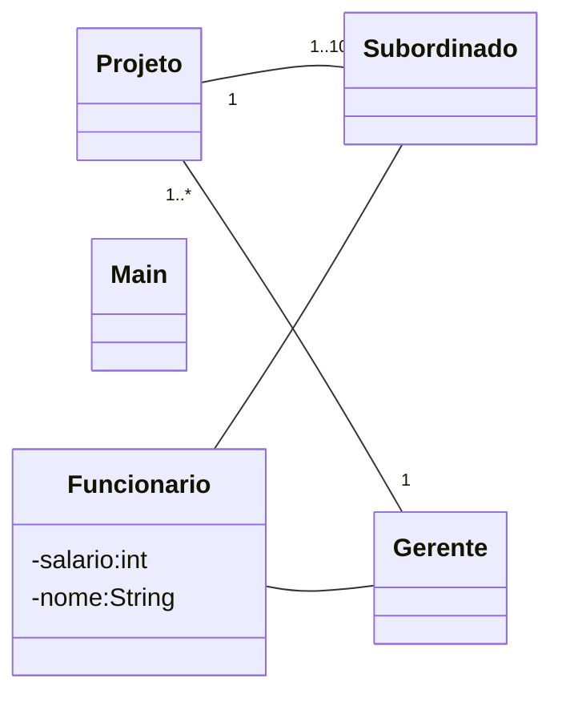

```mermaid
    classDiagram
        direction LR
        
        class Funcionario {
         -salario:int
         -nome:String
        }
        
        class Subordinado {
            
        }
        
        class Gerente {
            
        }
        
        class Main {
            
        }
        
        class Projeto {
            
        }
        
        Projeto "1..*" -- "1" Gerente
        Projeto "1" -- "1..100" Subordinado
        Funcionario -- Subordinado
        Funcionario -- Gerente
```