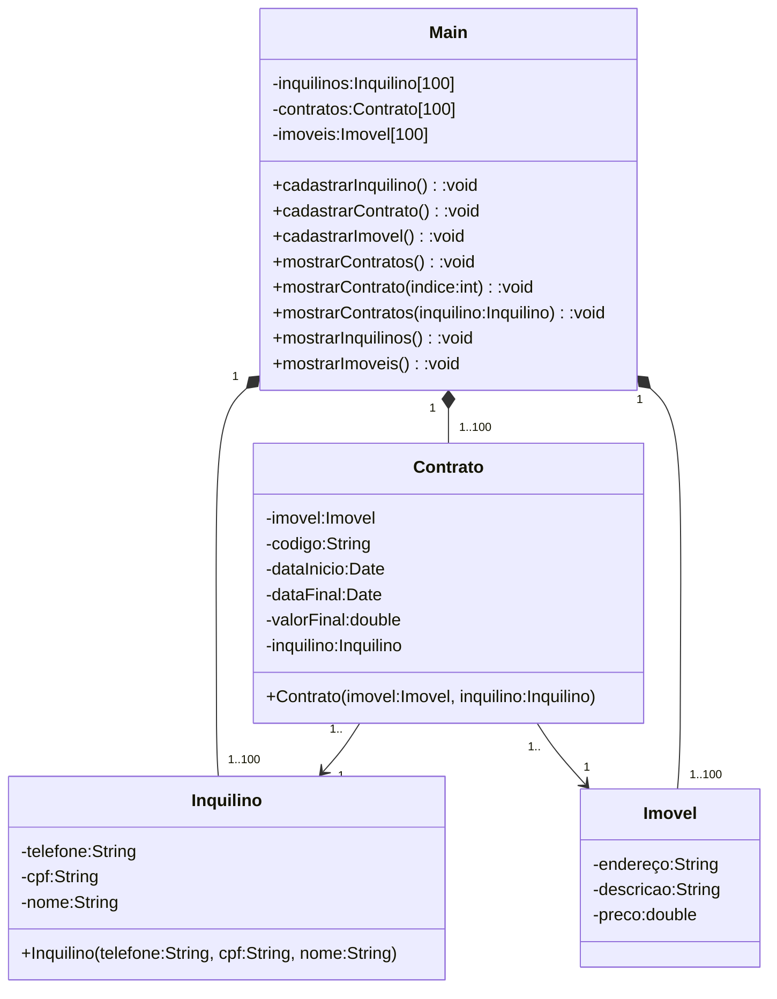

```mermaid
    classDiagram
        direction TB
        
        class Imovel{
            -endereço:String
            -descricao:String
            -preco:double
        }
        
        class Inquilino{
            +Inquilino(telefone:String, cpf:String, nome:String)
            -telefone:String
            -cpf:String
            -nome:String
        }

    class Contrato{
        +Contrato(imovel:Imovel, inquilino:Inquilino)
        -imovel:Imovel
        -codigo:String
        -dataInicio:Date
        -dataFinal:Date
        -valorFinal:double
        -inquilino:Inquilino
    }
        
        class Main{
            -inquilinos:Inquilino[100]
            -contratos:Contrato[100]
            -imoveis:Imovel[100]
            
            +cadastrarInquilino():void
            +cadastrarContrato():void
            +cadastrarImovel():void
            
            +mostrarContratos():void
            +mostrarContrato(indice:int):void
            +mostrarContratos(inquilino:Inquilino):void
            +mostrarInquilinos():void
            +mostrarImoveis():void
        }

    
   
        
        Main "1" *-- "1..100" Inquilino
        Main "1" *-- "1..100" Contrato
        Contrato "1.." --> "1" Inquilino
        Main "1" *-- "1..100" Imovel
        Contrato "1.." --> "1" Imovel    
        
```
