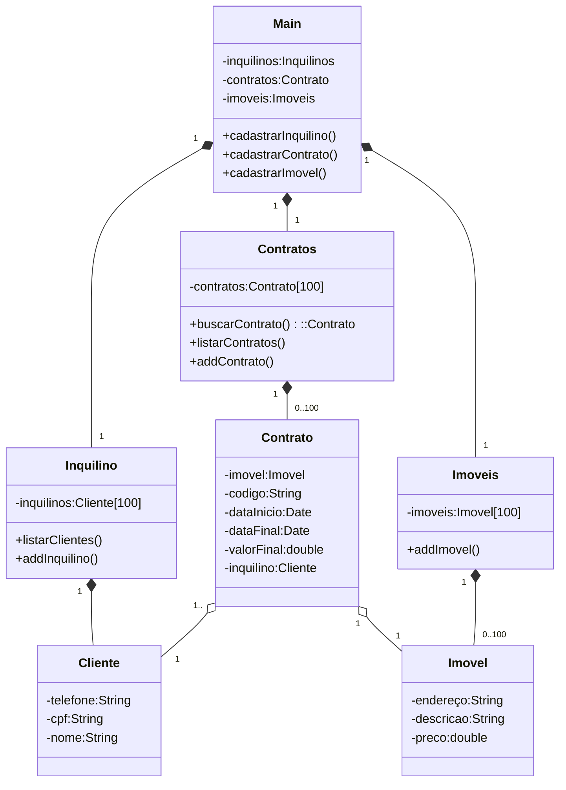

```mermaid
    classDiagram
        direction TB
        
        class Imovel{
            -endereço:String
            -descricao:String
            -preco:double
        }
        
        class Imoveis{
            -imoveis:Imovel[100]
            +addImovel()
        }
        
        class Contrato{
            -imovel:Imovel
            -codigo:String
            -dataInicio:Date
            -dataFinal:Date
            -valorFinal:double
            -inquilino:Cliente
        }
        
        class Contratos{
            -contratos:Contrato[100]
            +buscarContrato()::Contrato
            +listarContratos()
            +addContrato()
        }
        
        class Inquilino{ 
            -inquilinos:Cliente[100]
            +listarClientes()
            +addInquilino()
        }
        
        class Cliente{
            -telefone:String
            -cpf:String
            -nome:String
        }
        
        class Main{
            -inquilinos:Inquilinos
            -contratos:Contrato
            -imoveis:Imoveis
            +cadastrarInquilino()
            +cadastrarContrato()
            +cadastrarImovel()
        }
        
        Main "1" *-- "1" Inquilino
        Main "1" *-- "1" Contratos
        Main "1" *-- "1" Imoveis
        
        Imoveis "1" *-- "0..100" Imovel
        Contratos "1" *-- "0..100" Contrato
        Inquilino "1" *-- Cliente
        
        Contrato "1.." o-- "1" Cliente
        Contrato "1" o-- "1" Imovel
```