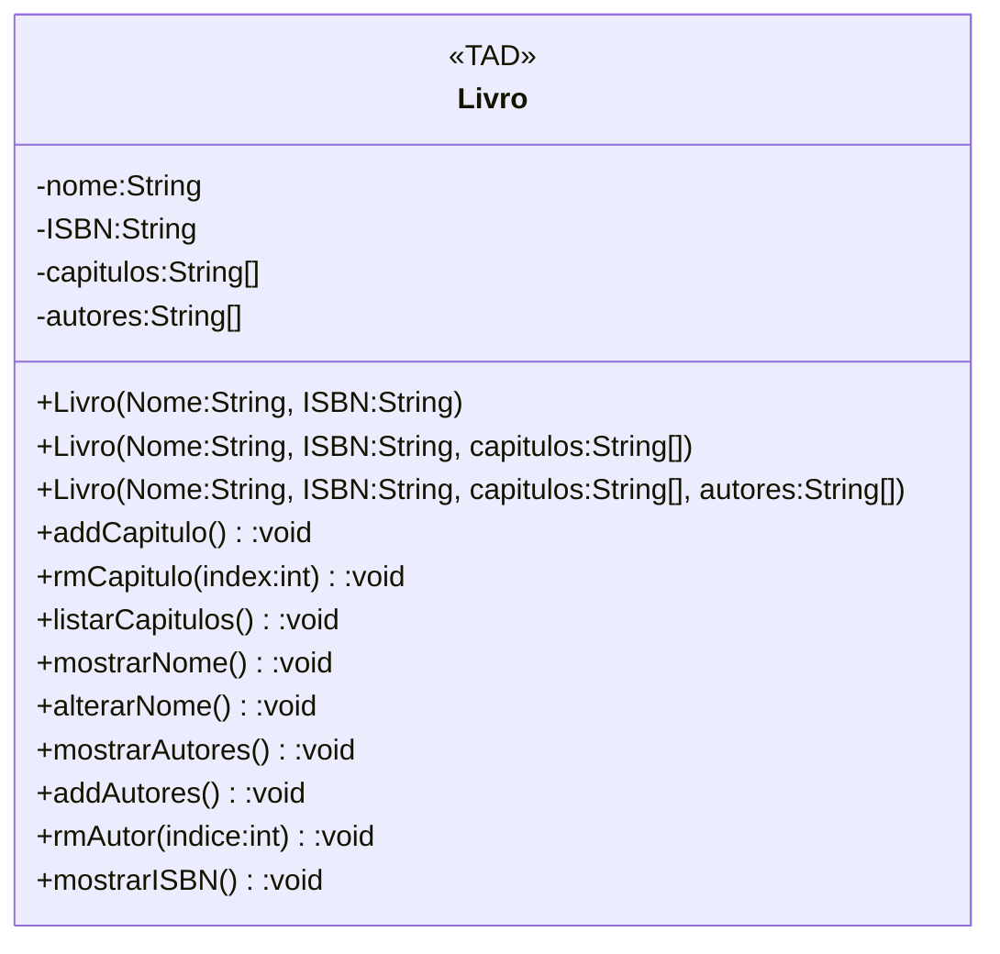

```mermaid
    classDiagram
        direction TB
        
        class Livro {
            <<TAD>>
           -nome:String
           -ISBN:String
           -capitulos:String[]
           -autores:String[]
           
           
           +Livro(Nome:String, ISBN:String)
           +Livro(Nome:String, ISBN:String, capitulos:String[])
           +Livro(Nome:String, ISBN:String, capitulos:String[], autores:String[])
           
            +addCapitulo():void
            +rmCapitulo(index:int):void
            +listarCapitulos():void
            
            +mostrarNome():void
            +alterarNome():void
            
            +mostrarAutores():void
            +addAutores():void
            +rmAutor(indice:int):void
            
            +mostrarISBN():void
        }  
```