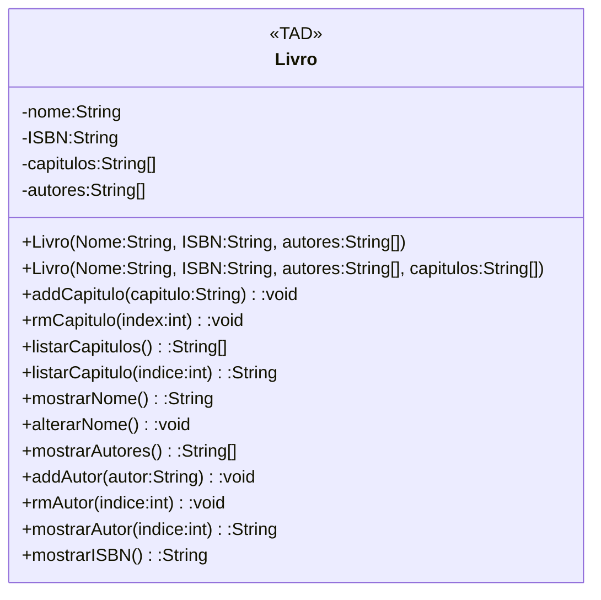

Regras de negócio: 
Um livro tem um nome, um ISBN, um ou mais capítulos (ou formas de organizar o texto em partes), e um ou mais autores, sendo todos eles dados de tipo texto. Sendo o ISBN um valor constante e que não pode ser alterado após a criação do objeto livro.
Obrigatoriamente precisa ser passados o nome do livro, o ISBN, e um array com o(s) nome(s) do(s) autor(es). Mas pode ser criado um livro com as informações dos capítulos.

O nome pode ser obtido e alterado, o ISBN pode ser obtido, o autor ou os autores podem ser obtidos um pelo seu ID no array ou ter retornado o array com todos os autores,
adicionar autor com o nome e remover autor com o índice no array, os capitulos podem ser obtidos por id ou ter o array inteiro obtido,
um capitulo pode ser adicionado com o título do capítulo ou ser removido com o índice no array.

