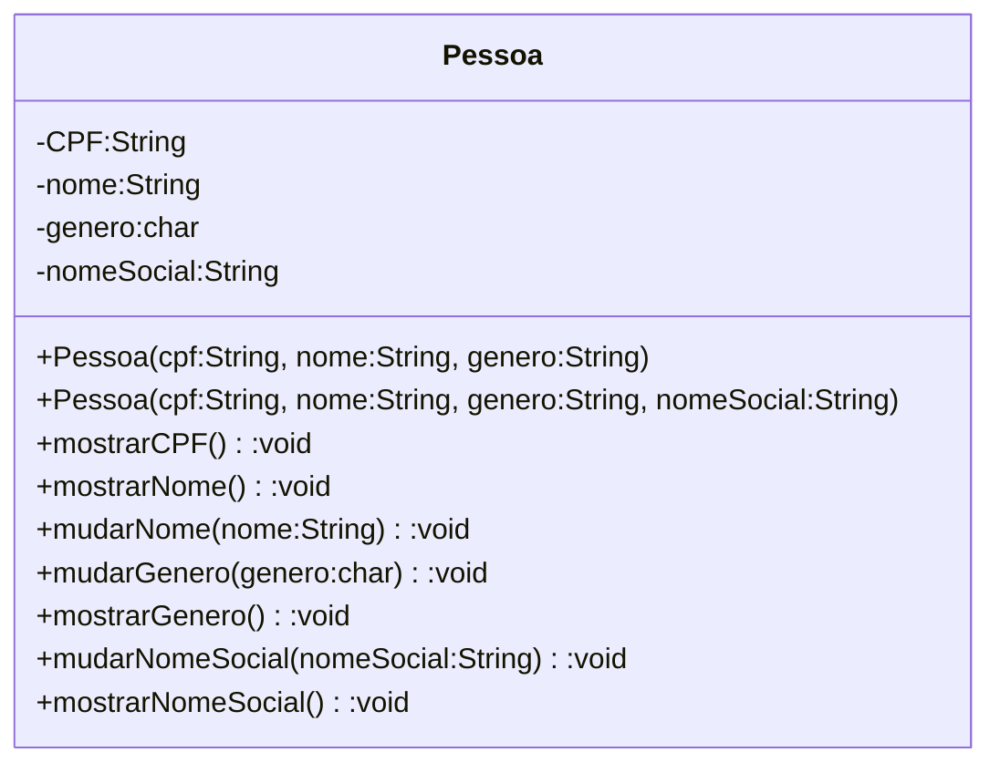

```mermaid
    classDiagram
        direction TB
        
        class Pessoa{
            -CPF:String
            -nome:String
            -genero:char
            -nomeSocial:String
        
            +Pessoa(cpf:String, nome:String, genero:String)
            +Pessoa(cpf:String, nome:String, genero:String, nomeSocial:String)
        
            +mostrarCPF():void
            
            +mostrarNome():void
            +mudarNome(nome:String):void
        
            +mudarGenero(genero:char):void
            +mostrarGenero():void
            
            +mudarNomeSocial(nomeSocial:String):void
            +mostrarNomeSocial():void
        }
```